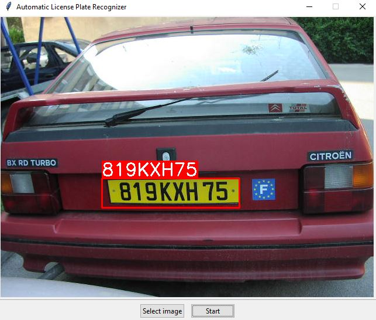

# Automatic license plate recognition using deep models

Master of Science Thesis at Faculty of Electrical Engineering and Computing, University of Zagreb, under the 
mentorship of izv. prof. dr. sc. Marko Čupić.

---

### Abstract

Automatic license plate recognition, nowadays, is an ubiquitous system whose application is mostly used in the field of security and surveillance. Parking zones and parking garages regulation, tolls payment, heavy traffic roads supervision are just some of its application. Since the domain of application is at high risk, the system must be extremely precise and fast. In order for this to be possible, it is necessary to do a lot of research in the field of computer vision, machine and deep learning. In this paper, a simple prototype system is presented that performs license plate detection and recognition, relying on image processing and deep learning algorithms. The system achieves 98% detection accuracy and 93% recognition accuracy on the original train set, and it achieves 100% detection accuracy and 30% recognition accuracy on the test set. Since the train set is relatively scarce, the results are promising even though the models are drastically overfitted. Also, for any near real-time use, the system runs extremely slow. In addition to the all above, this paper provides a detailed introduction into the field of object detection and optical character recognition.

**Keywords:** Automatic license plate recognition, ANPR, LPR, contrast enhancement, RGB to YCrCb conversion, contrast-limited adaptive histogram equalization (CLAHE), selective search, convolutional neural networks (CNN), cross-entropy loss, bidirectional long short-term memory recurrent neural network (BiLSTM-RNN), connectionist temporal classification (CTC) loss, data augmentation, Adam, intersection over union (IoU), object detection, sequence labeling.

---

### Examples

